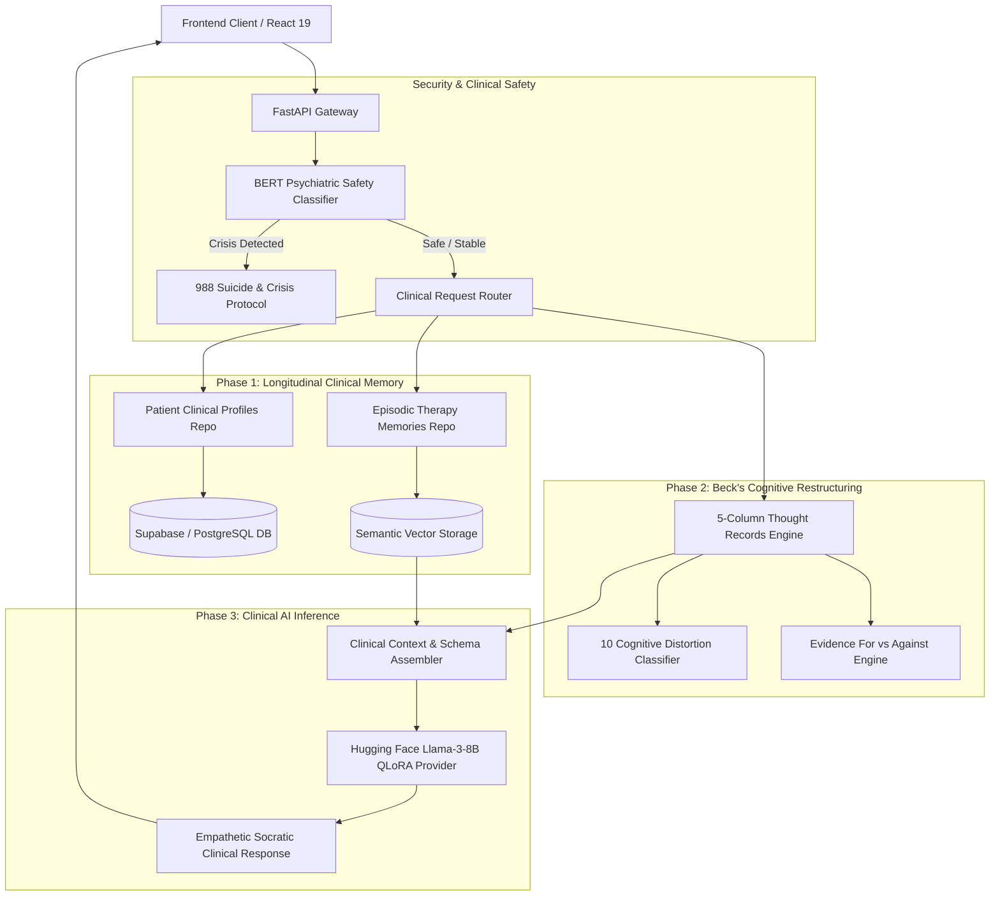

# 🧠 Better Me: Clinical CBT Backend & Longitudinal AI Memory Engine

> **BS Final Year Project (FYP)**  
> **Department:** Department of Computer Science & Software Engineering  
> **Project Supervisor:** Mam Farnaz Akbar  
> **Team Members:**  
> - **Awais Khan**  
> - **Saad Abdullah**  
> - **Ajiya Asif**  

---

## 📌 Overview

**Better Me Backend** is a high-performance clinical backend engineered with **FastAPI**, **SQLAlchemy**, and **Hugging Face Transformers**. Unlike generic generative AI chatbots, this system acts as a **structured clinical cognitive restructuring engine** based on **Dr. Aaron T. Beck’s Cognitive Behavioral Therapy (CBT)** framework.

It integrates:

1. **Longitudinal Clinical Memory Engine** (`patient_clinical_profiles` & `episodic_therapy_memories`).
2. **Beck's 5-Column Cognitive Restructuring Studio** (Automated distortion classification & reframing).
3. **Fine-Tuned Llama-3-8B-Instruct Model** (4-bit QLoRA adapter: [`awaiskhan4039/better-me-cbt-llama3-lora`](https://huggingface.co/awaiskhan4039/better-me-cbt-llama3-lora)).
4. **BERT Psychiatric Safety Classifier** (Automated self-harm/crisis triage with 988 emergency hotline fallback).

---

## 🏛️ System Architecture



---

## 🔬 Core Clinical Phases Implemented

### 🔹 Phase 1: Longitudinal Clinical Memory Engine

Traditional LLM wrappers suffer from **conversational amnesia**—treating the patient as a stranger in every new session. Phase 1 provides stateful continuity:

1. **`patient_clinical_profiles`**:
   - Stores baseline intake assessments (PHQ-9 Depression, GAD-7 Anxiety).
   - Identifies and tracks persistent core schemas (*"Defectiveness"*, *"Abandonment"*, *"Unrelenting Standards"*).
   - Records attachment styles and preferred grounding techniques.
2. **`episodic_therapy_memories`**:
   - Automatically summarizes therapy milestones at the conclusion of each conversation.
   - Extracts breakthrough insights, emotional volatility metrics, and recurring behavioral triggers.
   - Uses semantic vector retrieval to recall relevant past therapy memories when a user mentions familiar triggers weeks later.
3. **BERT Safety Filter**:
   - Real-time screening of all inputs before passing to generative models.
   - Bypasses text generation and delivers structured crisis resources if suicidal ideation is detected.

---

### 🔹 Phase 2: Beck's 5-Column Cognitive Restructuring Studio

#### Clinical Justification

In Beckian Cognitive Therapy:

$$\text{Situation} \longrightarrow \text{Automatic Thoughts} \longrightarrow \text{Emotional Reaction}$$

Psychological distress is maintained by systematic cognitive errors (**Cognitive Distortions**). Rather than generic unstructured chat, the backend provides endpoints for the rigorous 5-Column Exercise:

| Column | Phase | Purpose |
| :--- | :--- | :--- |
| **Col 1** | **Situation** | Objective context (who, where, when). |
| **Col 2** | **Automatic Thought** | Raw automatic negative thought and initial distress intensity (0–100%). |
| **Col 3** | **Distortion Classifier** | Categorization into 10 Beckian distortions (Catastrophizing, Mind Reading, etc.). |
| **Col 4** | **Evidence Examination** | Strict separation of objective facts: **Evidence For** vs. **Evidence Against**. |
| **Col 5** | **Balanced Alternative** | Formulating rational reframed belief with post-exercise distress rating. |

#### 10 Cognitive Distortions Handled

1. All-or-Nothing Thinking
2. Catastrophizing
3. Mind Reading
4. Emotional Reasoning
5. Overgeneralization
6. "Should" / "Must" Statements
7. Mental Filter
8. Disqualifying the Positive
9. Personalization
10. Labeling

---

### 🔹 Phase 3: Fine-Tuned Llama-3-8B QLoRA Model

- **Base Foundation Model:** `meta-llama/Meta-Llama-3-8B-Instruct`
- **Methodology:** Parameter-Efficient Fine-Tuning (PEFT) via **4-bit QLoRA** (`bitsandbytes`).
- **Target Projection Layers:** `q_proj`, `k_proj`, `v_proj`, `o_proj`, `gate_proj`, `up_proj`, `down_proj`.
- **Hyperparameters:** LoRA Rank $r=16$, LoRA Alpha $\alpha=32$, Dropout $0.05$.
- **Training Dataset:** `training/cbt_dataset.json` curated with clinical multi-turn Socratic dialogues.
- **Hugging Face Model Repository:** [`awaiskhan4039/better-me-cbt-llama3-lora`](https://huggingface.co/awaiskhan4039/better-me-cbt-llama3-lora)
- **Training Script:** [`training/train_cbt_llama3_colab.ipynb`](training/train_cbt_llama3_colab.ipynb)

---

## 📡 REST API Endpoints Specification

### 1. Authentication & Profiles (`/api/auth`)

| Method | Endpoint | Description |
| :--- | :--- | :--- |
| `POST` | `/api/auth/register` | Register new patient account with password hashing |
| `POST` | `/api/auth/login` | Authenticate patient credentials |
| `GET` | `/api/auth/me/{user_id}` | Fetch profile, intake completion status, and active metadata |

### 2. Clinical Intake Assessment (`/api/intake`)

| Method | Endpoint | Description |
| :--- | :--- | :--- |
| `POST` | `/api/intake` | Submit 5-step clinical intake (PHQ-9, GAD-7, triggers, goals) |
| `GET` | `/api/intake/{user_id}` | Retrieve patient diagnostic baseline scores |

### 3. Thought Records & Cognitive Restructuring (`/api/thought-records`)

| Method | Endpoint | Description |
| :--- | :--- | :--- |
| `POST` | `/api/thought-records` | Save a new 5-column cognitive restructuring record |
| `GET` | `/api/thought-records/{user_id}` | List historical thought records for patient progress timeline |
| `DELETE` | `/api/thought-records/{record_id}` | Delete a thought record |

### 4. Cognitive & Safety Analysis (`/api/analyze`)

| Method | Endpoint | Description |
| :--- | :--- | :--- |
| `POST` | `/api/analyze/distortion` | Classify user thought into Beck's 10 cognitive distortions |
| `POST` | `/api/analyze/safety` | Evaluate text for acute psychiatric risk / self-harm triggers |

### 5. Therapy Conversations & Memory Recall (`/api/conversations`)

| Method | Endpoint | Description |
| :--- | :--- | :--- |
| `POST` | `/api/conversations/chat` | Generate clinical Socratic CBT response with memory recall |
| `GET` | `/api/conversations/history/{user_id}` | Fetch previous session message threads |

### 6. Analytics & Progress (`/api/analytics`)

| Method | Endpoint | Description |
| :--- | :--- | :--- |
| `GET` | `/api/analytics/{user_id}` | Calculate distress reduction delta, distortion frequency, and mood trends |

---

## 💾 Database Schema

The database schema is defined in [`app/db/phase1_clinical_memory_schema.sql`](app/db/phase1_clinical_memory_schema.sql):

```sql
-- 1. Patient Clinical Profile (Diagnostic Baseline & Persistent Themes)
CREATE TABLE IF NOT EXISTS patient_clinical_profiles (
    id UUID PRIMARY KEY DEFAULT gen_random_uuid(),
    user_id UUID UNIQUE NOT NULL REFERENCES users(id) ON DELETE CASCADE,
    baseline_phq9_score INTEGER,
    baseline_gad7_score INTEGER,
    primary_cognitive_schemas TEXT[],
    chronic_stressors TEXT[],
    coping_mechanisms TEXT[],
    attachment_style VARCHAR(50),
    created_at TIMESTAMP WITH TIME ZONE DEFAULT CURRENT_TIMESTAMP,
    updated_at TIMESTAMP WITH TIME ZONE DEFAULT CURRENT_TIMESTAMP
);

-- 2. Episodic Therapy Memories (Longitudinal Session Milestones)
CREATE TABLE IF NOT EXISTS episodic_therapy_memories (
    id UUID PRIMARY KEY DEFAULT gen_random_uuid(),
    user_id UUID NOT NULL REFERENCES users(id) ON DELETE CASCADE,
    session_id UUID,
    milestone_summary TEXT NOT NULL,
    key_cognitive_distortions TEXT[],
    breakthrough_insights TEXT,
    emotional_trajectory JSONB,
    importance_weight REAL DEFAULT 1.0,
    created_at TIMESTAMP WITH TIME ZONE DEFAULT CURRENT_TIMESTAMP
);

-- 3. Beck's 5-Column Thought Records
CREATE TABLE IF NOT EXISTS thought_records (
    id UUID PRIMARY KEY DEFAULT gen_random_uuid(),
    user_id UUID NOT NULL REFERENCES users(id) ON DELETE CASCADE,
    situation TEXT NOT NULL,
    automatic_thought TEXT NOT NULL,
    cognitive_distortion VARCHAR(100) NOT NULL,
    evidence_for TEXT NOT NULL,
    evidence_against TEXT NOT NULL,
    balanced_thought TEXT NOT NULL,
    pre_distress_rating INTEGER NOT NULL,
    post_distress_rating INTEGER NOT NULL,
    created_at TIMESTAMP WITH TIME ZONE DEFAULT CURRENT_TIMESTAMP
);
```

---

## 🚀 Setup & Local Execution Guide

### 1. Prerequisites

- Python $\ge$ 3.10
- PostgreSQL database or Supabase instance
- Hugging Face account token

### 2. Virtual Environment Setup

```bash
# Navigate to backend directory
cd backend

# Create virtual environment
python -m venv venv

# Activate virtual environment
# Windows (PowerShell):
.\venv\Scripts\Activate.ps1
# Linux / macOS:
source venv/bin/activate
```

### 3. Install Dependencies

```bash
pip install -r requirements.txt
```

### 4. Configure Environment Variables (`backend/.env`)

```env
# Database Connection
DATABASE_URL=postgresql://postgres:[PASSWORD]@[HOST]:5432/postgres

# Hugging Face Model & Token
HUGGINGFACE_API_KEY=hf_your_huggingface_token
HF_MODEL_ID=awaiskhan4039/better-me-cbt-llama3-lora

# Supabase Auth Integration
SUPABASE_URL=https://csceryxjmluvegbdekxe.supabase.co
SUPABASE_ANON_KEY=your_supabase_anon_key

# Security & CORS
SECRET_KEY=better_me_jwt_secret_key_2026
ALLOWED_ORIGINS=http://localhost:5173,http://localhost:3000
```

### 5. Run Database Migrations

```bash
psql -U postgres -d postgres -f app/db/phase1_clinical_memory_schema.sql
```

### 6. Start the API Server

```bash
uvicorn main:app --reload --host 0.0.0.0 --port 8000
```

Interactive API documentation will be available at:

- **Swagger UI:** `http://localhost:8000/docs`
- **ReDoc:** `http://localhost:8000/redoc`

---

## 🐳 Docker Deployment

The backend includes a production-ready `Dockerfile`:

```bash
# Build Docker image
docker build -t better-me-backend .

# Run container
docker run -p 8000:8000 --env-file .env better-me-backend
```

---

## 🎓 Academic FYP Attribution

- **Project Title:** Better Me — AI Clinical CBT Companion & Longitudinal Memory Engine  
- **Academic Level:** BS Final Year Project (FYP) 2026  
- **Project Supervisor:** **Mam Farnaz Akbar**  
- **Team Members:**  
  - **Awais Khan** — Lead AI/ML Engineer & Fine-Tuning Specialist  
  - **Saad Abdullah** — Clinical Memory Engine & Thought Records Architect  
  - **Ajiya Asif** — Clinical Assessment Pipeline & Security Lead  
